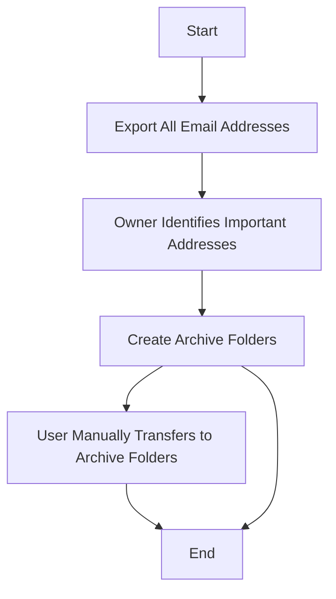
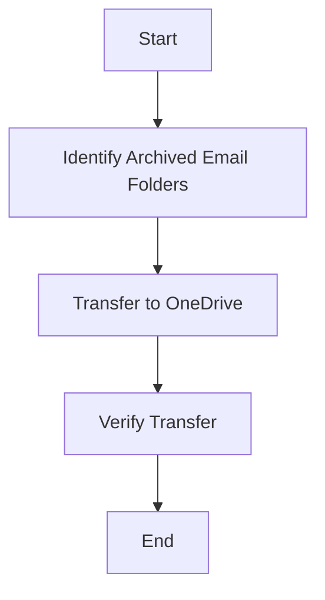
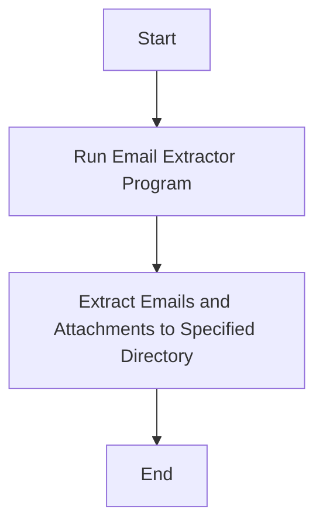
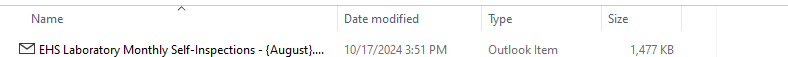
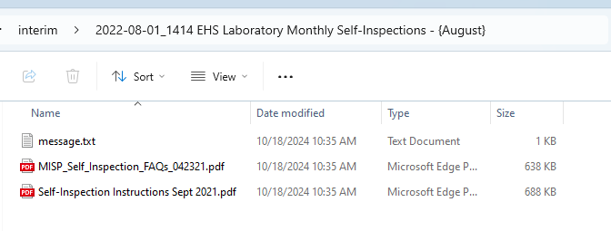

# email_archive

## Table of Contents

- [Summary](#summary)
- [Junk Mail Cleanup](#junk-mail-cleanup)
- [Organization for Email Archiving](#organization-for-email-archiving)
- [Email Message Transfer](#email-message-transfer)
- [Email Message Extraction](#email-message-extraction)
- [Searchable Archive](#searchable-archive)
- [Running email message extractor](#running-email-message-extractor)
- [Problem Statement](#problem-statement)
- [User Impact](#user-impact)
- [Asks:  Assistance in Cleaning, Organizing, and Archiving](#asks--assistance-in-cleaning-organizing-and-archiving)
- [Setting Up Outlook Processes](#setting-up-outlook-processes)
- [Project Organization](#project-organization)

## Summary

The purpose of this repo was to develop a plan for archiving important medical emails in anticipation of a new policy that will permanently delete emails older than two years from your account. It outlines possible strategies and tools for identifying, organizing, and preserving critical messages and attachments to ensure valuable information is not lost during the automated deletion process.

> **Note:** The new email retention policy has already gone into effect as of February 28, 2025. Emails older than two years are now subject to permanent deletion.

<a target="_blank" href="https://cookiecutter-data-science.drivendata.org/">
    
</a>


## Junk Mail Cleanup

```mermaid
flowchart TD
    %% Node styles with colors
    classDef startNode fill:#d4f1f9,stroke:#05728f,stroke-width:2px
    classDef process fill:#e1f5fe,stroke:#0288d1,stroke-width:2px
    classDef decision fill:#fff8e1,stroke:#ffa000,stroke-width:2px
    classDef endNode fill:#e8f5e9,stroke:#2e7d32,stroke-width:2px
    classDef userTask fill:#f3e5f5,stroke:#7b1fa2,stroke-width:2px

    %% Main flow with descriptive labels
    A["🚀 Start"] --> B["🧹 Cleanup Old Junk Mail"]
    B --> C["🔍 HITS identifies Junk Mail Addresses"]
    C --> D["📋 Apply to Email Sweep List in Outlook"]
    D --> E["✅ End of Cleanup"]
    B --> |Owner Task| M1["👤 Identify old junk emails"]
    M1 --> D
    D --> |Check| D1{"🔄 Sweep List Up-to-Date?"}
    D1 --> |Yes| E
    D1 --> |No| C
    D1 --> |No| M1

    %% Apply classes to nodes
    A:::startNode
    B:::process
    C:::process
    D:::process
    E:::endNode
    M1:::userTask
    D1:::decision





```


`


## Organization for Email Archiving




## Email Message Transfer




## Email Message Extraction


Example extracted email from a .msg file.





## Searchable Archive

Extract information from extracted emails and attachments to create a searchable archive.


## Running email message extractor
To run the email message extractor, you can use the [msg-extractor](https://github.com/TeamMsgExtractor/msg-extractor/tree/master) tool.


To extract messages from an example email archive, you can use the following command:

```bash
python -m extract_msg example.msg --out data/interim
```


## Problem Statement

**Policy Implementation**: On February 28, 2025, any emails older than two years will be permanently deleted from Microsoft Outlook, Exchange, and GroupWise, regardless of their folder location.


## User Impact
1. **Volume of Emails**: Hundreds of thousands of emails dating back as far as 20 years.
2. **Critical Information**: These emails may contain vital information, including essential attachments, which would be irrevocably lost if the emails are deleted.
3. **Impracticality of Manual Sorting**: Given the sheer volume of emails, it is impractical for users to manually sort through and save important emails and attachments.

**Consequence**: The automatic deletion will result in the permanent loss of potentially crucial information. This could lead to compliance issues, loss of valuable data, and contacts.


## Asks:  Assistance in Cleaning, Organizing, and Archiving

1. **Automated Sweep Rule Additions**:
    - Implement a script to automatically add sweep rules from a predefined file. This file should contain a list of email addresses and corresponding sweep folders.


2. **Assistance in Identification of Critial Emails**:
    - Generate a list of all email addresses.
    - Extract basic information from emails such as the number of times, earliest and latest email, and the number of times this email was seen.
    - Count the number of times each email address appears in the archive.


3. **Automatic archiving of emails in specific outlook folders**:
    - Develop a script that automatically archives emails in specific Outlook folders based on critical email criteria.
    - Archive any attachments associated with these emails.
    - Archived in a searchable format.

4. **Backup Plan**:
    - A temporary mass data backup before the automated deletion date.


## Setting Up Outlook Processes

1. **Sweep**:
    - Use the Sweep feature in Outlook to quickly delete or move emails from specific senders. An example table of sweep rules is provided below.  These would automatically be combined with existing rules to create a comprehensive list of sweep rules.

| Email                          | Sweep_Folder | Sender_Summary       | Implement |
|--------------------------------|--------------|----------------------|-----------|
| dpss-safety-security@umich.edu | sweep_misc   | Security emails      | Yes       |
| arcts-support@umich.edu        | sweep_IT     | Cluster compute emails| Yes      |
| safetytraining@umich.edu       | sweep_safety | Security emails      | Yes       |
| teamdynamix@umich.edu          | sweep_IT     | IT tickets           | Yes       |


### Identifying Critical Emails


1. **Email Analysis**:
    - Analyze emails to allow user to make an informed decision on how to archive email.


2. **Rules**:
    - Create rules to automate the organization of your emails
    - Based on criteria defined by user such as sender, subject, or keywords
    - Automate creation of rules based on user input.

### Archiving
1. **Searchable format**

2. **Archive attachments**

3. **Archive based on folders or other criteria**


### Additional identified issues
    - Slow manual transfer of emails to one drive
    - Exporting automated email addresses.  Possible solution being investigated.


example email archive

## Project Organization

```
├── LICENSE            <- Open-source license if one is chosen
├── Makefile           <- Makefile with convenience commands like `make data` or `make train`
├── README.md          <- The top-level README for developers using this project.
├── data
│   ├── external       <- Data from third party sources.
│   ├── interim        <- Intermediate data that has been transformed.
│   ├── processed      <- The final, canonical data sets for modeling.
│   └── raw            <- The original, immutable data dump.
│
├── docs               <- A default mkdocs project; see www.mkdocs.org for details
│
├── models             <- Trained and serialized models, model predictions, or model summaries
│
├── notebooks          <- Jupyter notebooks. Naming convention is a number (for ordering),
│                         the creator's initials, and a short `-` delimited description, e.g.
│                         `1.0-jqp-initial-data-exploration`.
│
├── pyproject.toml     <- Project configuration file with package metadata for
│                         email_archive and configuration for tools like black
│
├── references         <- Data dictionaries, manuals, and all other explanatory materials.
│
├── reports            <- Generated analysis as HTML, PDF, LaTeX, etc.
│   └── figures        <- Generated graphics and figures to be used in reporting
│
├── requirements.txt   <- The requirements file for reproducing the analysis environment, e.g.
│                         generated with `pip freeze > requirements.txt`
│
├── setup.cfg          <- Configuration file for flake8
│
└── email_archive   <- Source code for use in this project.
    │
    ├── __init__.py             <- Makes email_archive a Python module
    │
    ├── config.py               <- Store useful variables and configuration
    │
    ├── dataset.py              <- Scripts to download or generate data
    │
    ├── features.py             <- Code to create features for modeling
    │
    ├── modeling
    │   ├── __init__.py
    │   ├── predict.py          <- Code to run model inference with trained models
    │   └── train.py            <- Code to train models
    │
    └── plots.py                <- Code to create visualizations
```

--------

